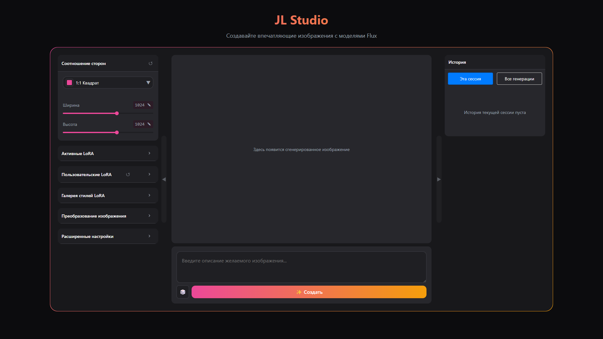
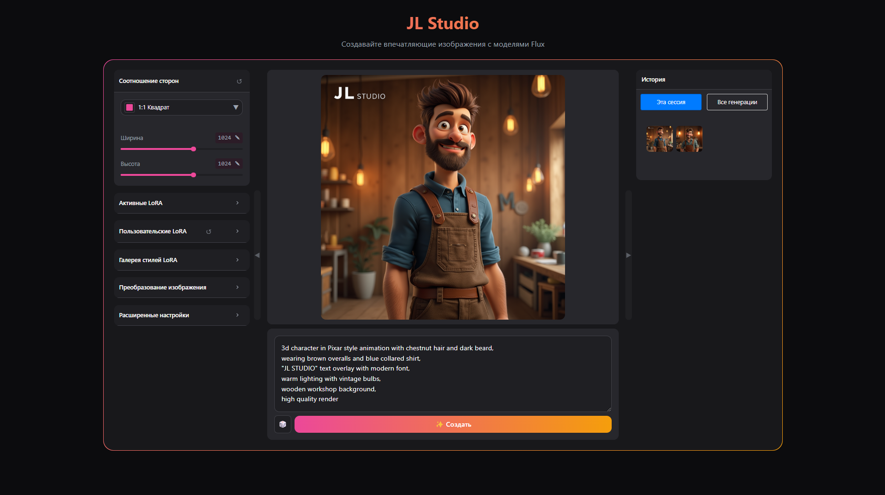
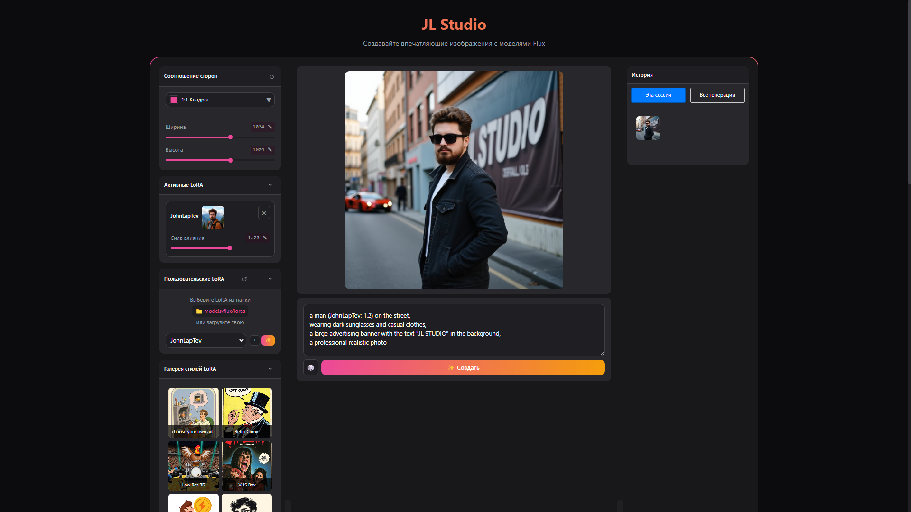
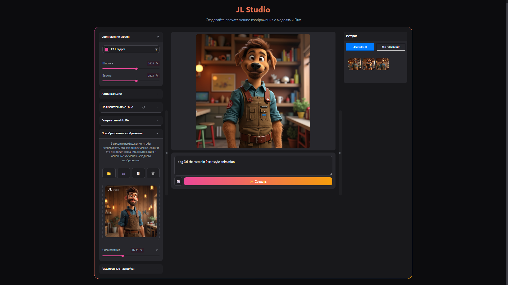
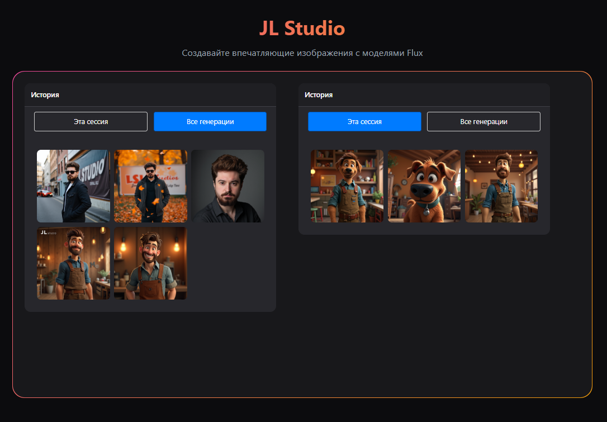
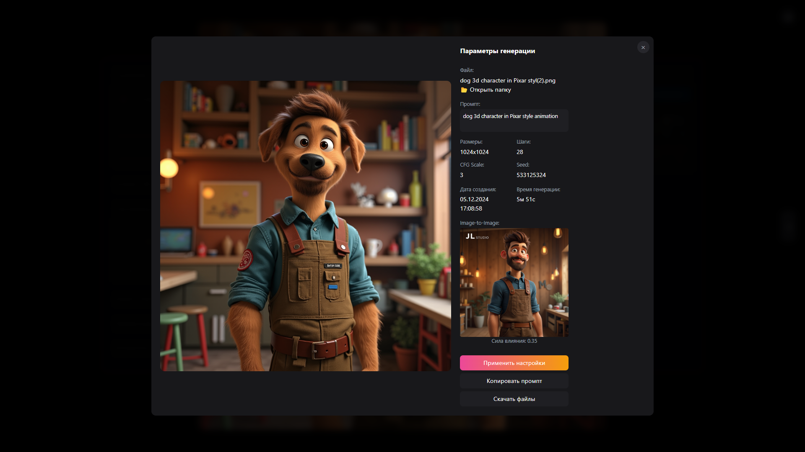
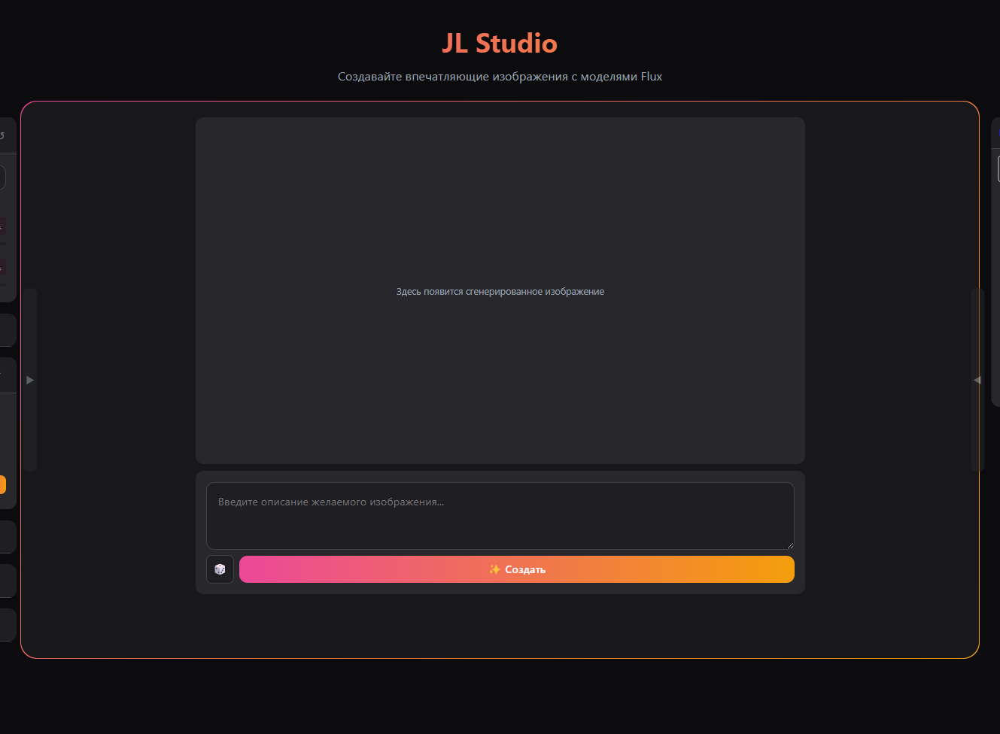

# JL Studio

[English version](README_EN.md) | [Установка](docs/installation.md) | [Руководство](docs/user-guide.md) | [FAQ](docs/faq.md)

JL Studio - программа для генерации изображений на основе текстовых описаний с использованием модели FLUX и технологии LoRA.

## 🚀 Возможности

### ✨ Генерация по описанию
Создавайте изображения, описывая их текстом. Используйте детальные промпты для лучших результатов.

### 🎨 Стилизация через LoRA
Применяйте и комбинируйте различные стили с помощью LoRA моделей.

### 🖼️ Image-to-Image
Преобразуйте существующие изображения, задавая желаемые изменения.

### 📊 История генераций
Просматривайте и повторно используйте успешные генерации.

### ⚙️ Гибкие настройки
Настраивайте все параметры генерации для оптимальных результатов.

### 📱 Адаптивный интерфейс
Сворачиваемые панели для удобной работы на любом экране.

## 🛠️ Системные требования

- Windows 10/11 (64-bit)
- Python 3.10.6
- NVIDIA GPU с 6+ GB VRAM
- 16+ GB RAM
- 50+ GB свободного места

## 📥 Быстрый старт

1. [Скачайте](https://github.com/John-LapTev/JL_Studio/releases) последнюю версию
2. Запустите `install.bat`
3. После установки запустите `START-WEB_JL_STUDIO.bat`
4. Откройте http://127.0.0.1:7860

Подробнее: [Инструкция по установке](docs/installation.md)

## 📚 Документация

- [Требования к системе](docs/requirements.md)
- [Инструкция по установке](docs/installation.md)
- [Руководство пользователя](docs/user-guide.md)
- [Работа с LoRA](docs/lora-guide.md)
- [FAQ](docs/faq.md)

## 📧 Контакты

- Telegram: [@john_laptev](https://t.me/john_laptev)
- Email: john.laptev@gmail.com

## 📄 Лицензия

MIT License. Подробности в [LICENSE](LICENSE)