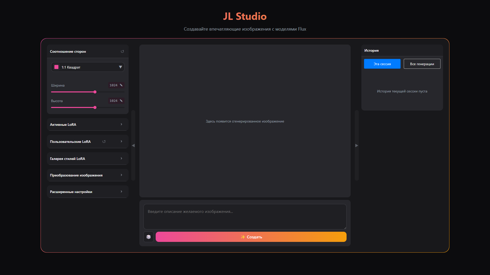
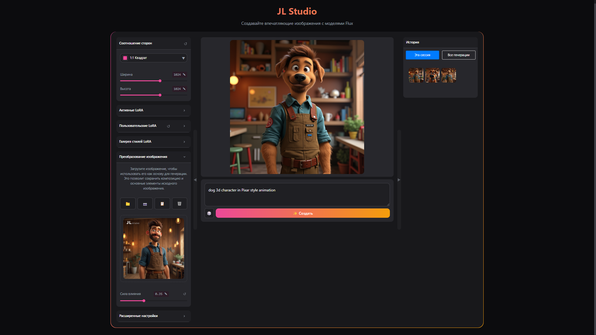

# JL Studio

[Russian version](README.md) | [Installation](docs/en/installation.md) | [User Guide](docs/en/user-guide.md) | [FAQ](docs/en/faq.md)

JL Studio is an image generation program based on text descriptions using the FLUX model and LoRA technology.

## 🚀 Features

### ✨ Text-to-Image Generation
Create images by describing them in text. Use detailed prompts for better results.

### 🎨 LoRA Stylization
Apply and combine different styles using LoRA models.

### 🖼️ Image-to-Image
Transform existing images by specifying desired changes.

### 📊 Generation History
View and reuse successful generations.

### ⚙️ Flexible Settings
Configure all generation parameters for optimal results.

### 📱 Adaptive Interface
Collapsible panels for comfortable work on any screen.

## 🛠️ System Requirements

- Windows 10/11 (64-bit)
- Python 3.10.6
- NVIDIA GPU with 6+ GB VRAM
- 16+ GB RAM
- 50+ GB free disk space

## 📥 Quick Start

1. [Download](https://github.com/John-LapTev/JL_Studio/releases) latest version
2. Run `install.bat`
3. After installation run `START-WEB_JL_STUDIO.bat`
4. Open http://127.0.0.1:7860

Details: [Installation Guide](docs/en/installation.md)

## 📚 Documentation

- [System Requirements](docs/en/requirements.md)
- [Installation Guide](docs/en/installation.md)
- [User Guide](docs/en/user-guide.md)
- [Working with LoRA](docs/en/lora-guide.md)
- [FAQ](docs/en/faq.md)

## 📧 Contacts

- Telegram: [@john_laptev](https://t.me/john_laptev)
- Email: john.laptev@gmail.com

## 📄 License

MIT License. See [LICENSE](LICENSE)